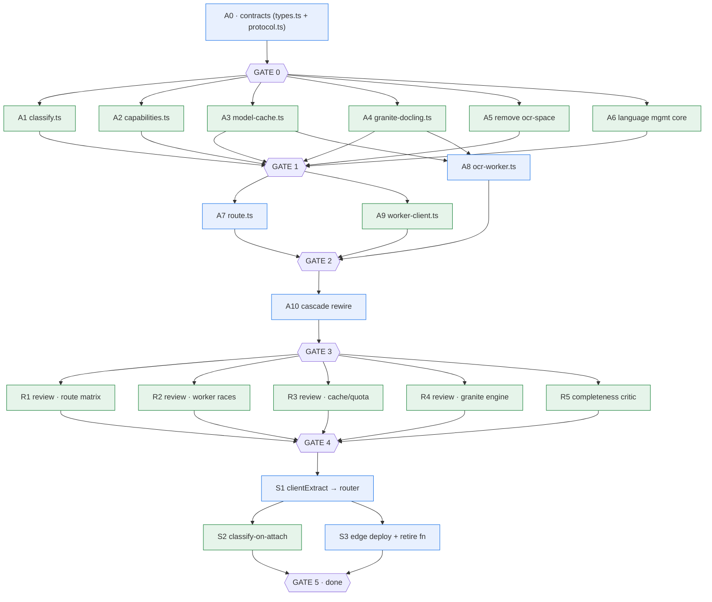

# liteparse — Intelligent Document Router (build plan · COMPLETED)

> **STATUS: ✅ BUILT.** Phases 0–5 complete (router live, browser-first, ocr.space
> removed, 2026-08-09/10). This file is the historical build record — kept for the
> routing matrix, locked contracts, and the phase/gate structure. The **live forward
> roadmap** (int8 → bilingual → litecomposer speech → Hono edge API) is now
> [ROADMAP.md](./ROADMAP.md). A few P5 deferrals remain open and are folded into the
> forward plan there.
>
> Pairs with [ARCHITECTURE.md](./ARCHITECTURE.md) (the *what*). This file is the
> *how*: how to build the router as a **long unattended multi-sub-agent workflow**.
> Each phase is a self-contained fan-out with a hard verification gate, so the
> whole thing can run with a human checking in only between phases.

## How to read this

- **Phases** are ordered by dependency. A later phase never starts before its
  predecessor's verification gate is green.
- Inside a phase, agents tagged **⏵ PARALLEL** have zero inter-dependencies and
  run concurrently (one agent = one module + its tests). Agents tagged **⏷ SERIAL**
  must finish before the next begins.
- **⏦ GATE** = `npm run typecheck && npm run test && npm run build` must pass
  before the next phase. This is the safety net that makes unattended operation
  safe — a broken contract surfaces here, not two phases later.
- Every agent codes against **interfaces locked in Phase 0**, never against
  another agent's in-flight implementation. That is the single most important
  rule: parallel agents never read each other's code; they share only contracts.

## Dependency graph

---

## Phase 0 — Foundation: lock the contracts · ⏷ SERIAL · 1 agent

Everything downstream codes against these. Get them right, or the whole fan-out
produces incompatible parts.

**Agent A0 — contracts**
- Depends on: nothing (reads ARCHITECTURE.md + existing `types.ts`)
- Writes:
  - `src/router/types.ts` — `DocumentProfile` (kind, pages, scanned, script,
    langHint, size), `RuntimeCapabilities` (runtime, hasWebGPU, metered,
    browserLanguages[], persisted), `RouteStrategy` (engine + location +
    reason), `RouteDecision` (ordered `RouteStrategy[]`)
  - `src/worker/protocol.ts` — the worker↔main message envelope: request
    (`{type:"parse", bytes, profile, route, id}`), progress
    (`{type:"progress", pageIndex, totalPages, stage}`), result
    (`{type:"result", text, source, warnings}`), error (`{type:"error",…}`)
- Test: types compile; a round-trip of every protocol message type-checks.
- **Done when**: `tsc --noEmit` clean; ARCHITECTURE's `DocumentProfile` fields
  and routing inputs are all represented.
- ⏦ **GATE 0**: typecheck + build green.

---

## Phase 1 — Parallel module build · ⏵ PARALLEL · 6 agents

All six write **disjoint files**, code only against Phase 0 contracts + existing
adapters, and each ships its own tests. They can run fully concurrently.

> **Shared-file rule:** no agent in Phase 1 edits `src/index.ts` or
> `package.json` exports. Each returns its finished source + the exact export
> lines it needs. The **integration agent in Phase 2** owns the export wiring,
> so there are never merge conflicts on those two files.

### Agent A1 — `src/router/classify.ts`
- Depends on: A0 types, existing `sniff.ts`, `pdf.ts`.
- Writes: `classifyDocument(bytes, filename, opts) → DocumentProfile`.
  - File type via sniff; page count via `pdfjs.numPages`; scanned/digital via
    `getTextContent()` char-count probe (>100 digital, <10 scanned, else probe
    more pages); script hint from a sampled text string.
- Test: fixtures — a digital PDF (→ scanned=false), a scanned PDF (→ true), an
  image (→ pages=1), an xlsx (→ kind=xlsx). Assert each profile field.
- Done when: tests green; classification < ~300ms on fixtures.

### Agent A2 — `src/router/capabilities.ts`
- Depends on: A0 types only.
- Writes: `detectCapabilities() → RuntimeCapabilities`.
  - WebGPU (`navigator.gpu?.requestAdapter()`), runtime sniff
    (browser/node/deno), connection metered
    (`navigator.connection.saveData`/`effectiveType`), storage-persist state,
    available browser languages (read cache index).
- Test: mock `navigator`/`self.gpu`/`navigator.connection`; assert each branch
  (hasWebGPU true/false, metered true/false).
- Done when: tests green; works headless (no GPU → `hasWebGPU:false`).

### Agent A3 — `src/worker/model-cache.ts`
- Depends on: A0 types only.
- Writes: IndexedDB wrapper — `getModel(id,version)`, `putModel(id,version,blob)`,
  `hasModel(id,version)`, `invalidate(id)`, `requestPersistent()`.
- Test: `fake-indexeddb` polyfill; put→get→has→invalidate round-trip; version
  mismatch returns miss.
- Done when: tests green; uses `navigator.storage.persist()` when available.
- *Note:* add `fake-indexeddb` to devDependencies (single edit, integration agent
  owns package.json — A3 reports the dep).

### Agent A4 — `src/ocr/granite-docling.ts`
- Depends on: A0 types + existing `OcrEngine` interface (`types.ts`).
- Writes: `createGraniteDoclingEngine(opts) → OcrEngine` in two execution modes:
  - browser: `onnxruntime-web` with WebGPU EP (fallback WASM)
  - edge: `onnxruntime-node`
  - Lazy session creation; warm singleton per mode; `recognize()` returns text +
    structure-aware output.
- Test: **mock the ONNX session** (inject a fake `InferenceSession` via opts) —
  assert the engine conforms to `OcrEngine`, handles empty/low-confidence, and
  falls through cleanly. Real-model inference is **not** tested here (no GPU in
  CI) — flagged for manual validation in Phase 4.
- Done when: tests green against the mock; `available` reflects WebGPU presence.
- *Note:* model URL/version constants live here; download is A8's job via A3.

### Agent A5 — remove ocr-space + cascade cleanup
- Depends on: A0 types; reads existing `cascade.ts`, `ocr/ocr-space.ts`.
- Writes/edits: delete `src/ocr/ocr-space.ts`; remove the whole-doc OCR slot from
  `cascade.ts` (the cascade now starts at per-page raster+OCR); remove the
  `./ocr/ocr-space` export from `package.json` (reports it to integration agent).
- Test: `parseWithFallbacks` still resolves text from a fixture via the
  remaining slots; the ocr-space import path 404s (proves removal).
- Done when: tests green; no reference to ocr.space remains in `src/`.

### Agent A6 — language management core
- Depends on: A0 types; existing `rapidocr.ts` (reads its model-id conventions).
- Writes: `src/router/languages.ts` — script detection
  (`detectScript(text) → "latin"|"arabic"|"cjk"|"cyrillic"|...`), model-id
  selection (`scriptToRecModel(script)`), and the **Latin + 1 dynamic** cap logic:
  `decideBrowserLanguages(detected, cached) → {load, offloadToEdge}`.
- Test: pure-logic tests — detect script from sample strings; assert a 3rd
  distinct script triggers `offloadToEdge`; assert Latin never offloads.
- Done when: tests green; the cap rule matches ARCHITECTURE's language section.

⏦ **GATE 1**: typecheck + test + build green across all six modules.

---

## Phase 2 — Integration wiring · mixed · 3 agents

Stitch the Phase 1 modules together. A7 and A9 are independent of each other;
A8 waits on A3 + A4.

### Agent A7 — `src/router/route.ts` · ⏷ SERIAL
- Depends on: A1 (classify output shape), A2 (capabilities shape), A0, A6.
- Writes: `routeDocument(profile, capabilities, opts) → RouteDecision`.
  Encodes the ARCHITECTURE routing matrix as pure rules → ordered
  `RouteStrategy[]` (e.g. image + Latin → `[rapidocr-browser]`; scanned PDF
  >threshold → `[rapidocr-edge, granite-edge, vlm-edge]`).
- Test: one assertion per **row of the routing matrix** (a table-driven test) —
  each (type, pages, scanned, script) input yields the expected strategy list.
  This test is the executable spec of the router.
- Done when: every matrix row passes.

### Agent A9 — `src/worker/worker-client.ts` · ⏵ PARALLEL (with A7)
- Depends on: A0 protocol only.
- Writes: `createWorkerOcrClient(opts)` — spawns the worker, posts a parse
  request, surfaces `onProgress` callbacks, returns a `Promise<result>`.
  Handles worker crash (reject), timeout, and abort.
- Test: mock worker (a stub that echoes protocol messages); assert progress
  events fire in order and the result resolves / errors propagate.
- Done when: tests green.

### Agent A8 — `src/worker/ocr-worker.ts` · ⏷ SERIAL (after A3, A4)
- Depends on: A0 protocol, A3 (cache), A4 (granite), existing `rapidocr.ts` +
  `raster/canvas.ts` + `pdf.ts`.
- Writes: the worker entry point. Receives `{bytes, profile, route, id}`,
  executes the `RouteDecision`: pdfjs render → `OffscreenCanvas` → preprocess →
  the right engine per route, posting `progress` per page and `result` at the
  end. Pulls models via A3 on demand; triggers lazy downloads (see Phase 1 A6).
- Test: hard to unit-test a real worker headless — extract a pure
  `executeRoute(bytes, route, deps)` core and unit-test **that** with injected
  fake engines + a fake raster. The thin worker shell just wires postMessage →
  `executeRoute`. Test the core thoroughly; the shell is smoke-tested in Phase 4.
- Done when: `executeRoute` core tests green.

⏦ **GATE 2**: typecheck + test + build green.

---

## Phase 3 — Cascade rewiring · ⏷ SERIAL · 1 agent

The architectural pivot point: `parseDocument` stops brute-forcing and starts
routing.

### Agent A10 — pipeline + cascade rewire
- Depends on: A7, A8, A9, A0, A2.
- Writes/edits: `pipeline.ts` / `cascade.ts` now do **classify → route →
  execute the ordered strategies** (consuming `routeDocument` +
  `executeRoute`/worker-client) instead of the linear fallback. Browser path
  goes through the worker (A9); node/edge path calls the engine cascade directly.
- Test: end-to-end with **mock engines** — feed a digital-PDF fixture, assert it
  never touches OCR; feed a scanned-PDF fixture, assert it hits the edge
  strategy list. Assert `source`/`warnings` reflect the route actually taken.
- Done when: integration tests green; brute-force fallback code is gone.

⏦ **GATE 3**: typecheck + test + build green. **At this point liteparse 0.3.0
is functionally complete** (router + worker + ocr-space removed). Granite is
real-model-integrated but only mock-tested.

---

## Phase 4 — Adversarial verification · ⏵ PARALLEL · 5 agents

Independent reviewers, each a different lens, each trying to break a specific
concern. Findings become a fix-list; nothing ships until the critics are quiet.

- **R1 — route-matrix critic**: re-derives every routing decision from
  ARCHITECTURE.md and diffs against A7's table test. Hunt for a matrix cell that
  produces the wrong engine, an infinite loop, or a dead strategy.
- **R2 — worker-race critic**: stress A8/A9 for postMessage ordering, an
  abort that arrives mid-page, a worker that dies mid-inference, duplicate result
  posts, unbounded progress spam.
- **R3 — cache/quota critic**: A3 under IndexedDB quota errors, concurrent
  downloads of the same model, eviction mid-use, version-skew between cached
  model and engine.
- **R4 — granite-engine critic**: A4 WebGPU→WASM fallback correctness, session
  lifecycle/leak, empty/oversized image input, the "no GPU → offload to edge"
  path.
- **R5 — completeness critic**: what's missing? (language preseed on app load,
  `navigator.connection` `change` re-check, error states, abort propagation
  through the whole chain, the image-escalation heuristic from ARCHITECTURE.)

⏦ **GATE 4**: all critics either pass or file verified, non-blocking findings;
typecheck + test + build still green.

---

## Phase 5 — Studygram integration · ⏷ SERIAL-ish · 3 agents

Touches `studygram-app`. Depends on liteparse 0.3.0 being cut (GATE 4). Run in
the studygram-app repo, not liteparse.

### Agent S1 — `clientExtract.ts` → router flow · ⏷ SERIAL
- Replaces the 3-tier brute-force fallback in `src/lib/clientExtract.ts` with
  the router: classify (on the bytes) → route → worker-client (browser) or edge
  call. Keeps the existing VLM-edge delegation contract.

### Agent S2 — classify-on-attach · ⏵ PARALLEL (with S3, after S1)
- In `AgentChatPanel.tsx`, kick off `classifyDocument` at attach time (overlaps
  user typing) so the route is decided before send. Surface per-page progress
  via the worker-client `onProgress` (replaces the current `ingestionProgress`).

### Agent S3 — edge deploy + retire parse-document · ⏷ SERIAL
- Deploy the edge with RapidOCR + Granite models and `RAPIDOCR_LANGUAGES`;
  retire the `parse-document` edge function. Per memory, Claude deploys edge
  functions directly via the Supabase Management API (multipart POST,
  `api.supabase.com`), never via Lovable; use the Supabase MCP, not the CLI;
  model keys stay server-side (Granite model is **downloaded at runtime**, never
  bundled into the client).

⏦ **GATE 5 · DONE**: Studygram builds, attachments route through the
intelligent router end-to-end, parse-document retired.

---

## Unattended-operation safeguards

1. **Contracts first.** Phase 0 is the only serial bottleneck and it's small.
   Everything parallel is gated on it. If GATE 0 is green, the fan-out is safe.
2. **Disjoint files in Phase 1.** Agents never write the same file. `index.ts`
   and `package.json` are touched by exactly one agent per phase (integration).
3. **Green gate, not green light.** A phase starts only when the prior gate is
   `typecheck && test && build` clean. A red gate halts and surfaces to a human.
4. **Mock the un-mockable.** Real ONNX/WebGPU/IndexedDB-worker behavior can't
   run in headless CI. Phase 1–3 test against injected fakes; Phase 4 is where
   logic is adversarially checked; **real-model inference validation is a
   separate manual/GPU step**, explicitly not part of the unattended run.
5. **Idempotent agents.** Each agent either writes a finished file or fails —
   never partially. Re-running an agent reproduces the same output, so a resume
   after a halt is clean.

## Translating this to a Workflow run

Each phase is one `Workflow` invocation (so a human reviews between phases):

- **Phase 0**: `agent(A0-prompt, {schema})` — single serial call.
- **Phase 1**: `parallel([A1…A6].map(a => () => agent(a.prompt, {schema})))` —
  the big fan-out. Each agent returns its file source + tests + any dep/edit
  request; the orchestrator applies them.
- **Phase 2**: `parallel([A7, A9])` then `agent(A8)` (A8 waits on A3/A4 results
  from Phase 1, already cached).
- **Phase 3**: `agent(A10)`.
- **Phase 4**: `parallel([R1…R5])` → synthesize a fix-list.
- **Phase 5**: `agent(S1)` → `parallel([S2, S3])`.

Per-agent prompts are generated from the specs above (depends-on, writes, test,
done-when). The `schema` for build agents returns `{files:[{path,content}],
testCommand, testResult, requests:[{editDep?, exportLine?}]}` so the
orchestrator can apply disjoint writes and collect the integration agent's
to-do list without merge conflicts.
